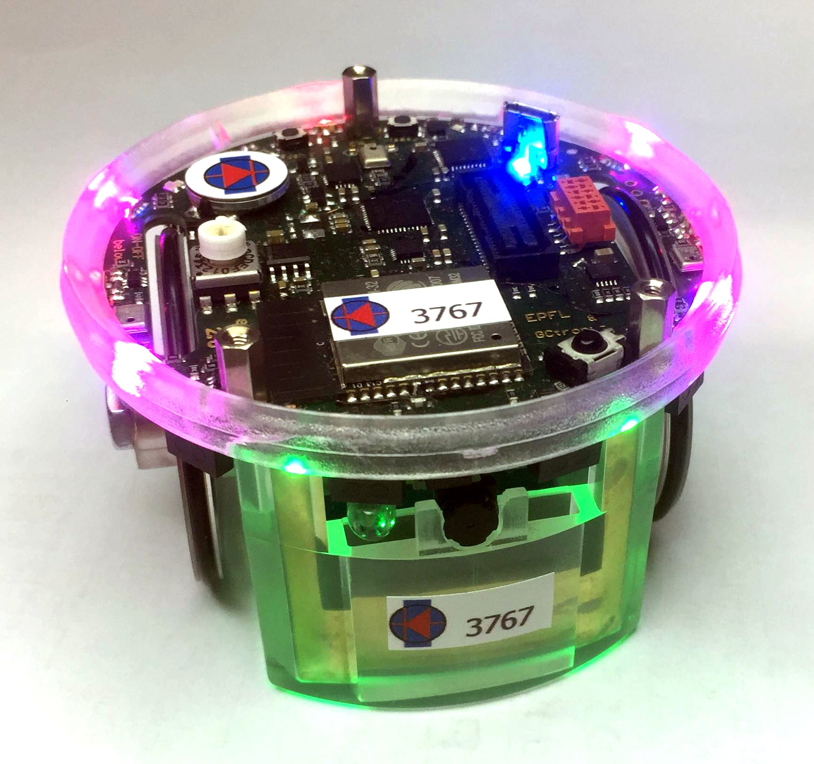

# Epuck2-Project-Introduction
本项目主要研究内容为基于ROS2实现epuck2群智机器人基础功能及在各类特定场景中发挥多机器人优势，已参加相关比赛srtp国家级项目，已获中国大学生计算机设计大赛三等奖。

学习方向：ROS2基本知识，Epuck多传感器融合建图导航

epuck2相关资料：http://www.rosrobot.cn/?tags=36

pi-puck相关资料：http://www.rosrobot.cn/?cate=11

ROS2学习资料：https://www.mubu.com/doc/2KrR_lVv0cs

计设文档链接：https://pan.baidu.com/s/1LhhflCOCaNtV8-GXzQexBA
